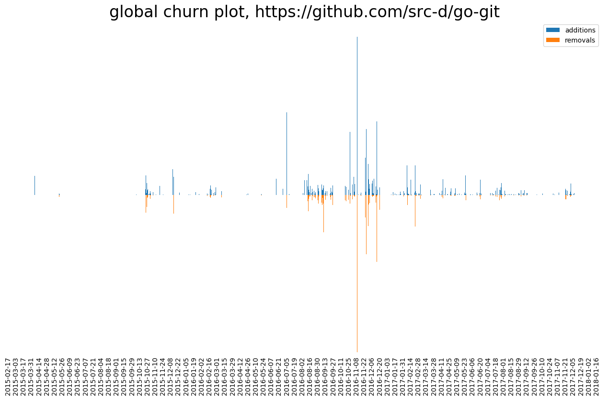

Hercules plugins
================

### Prerequisites

It is required to have [GoGo Protobuf](https://github.com/gogo/protobuf) installed:

```
go get github.com/gogo/protobuf/protoc-gen-gogo
```

There must be the `protoc` tool available in `$PATH`, version 3. Grab it from the
[official Protocol Buffers releases page](https://github.com/google/protobuf/releases) (`protoc-*.zip`).

### Creating a new plugin

Generation of a new plugin skeleton:

```
hercules generate-plugin -n MyPluginName -o my_plugin
```

This command creates:

* `my_plugin/my_plugin_name.go` with the plugin source code. Refer to the docs about [LeafPipelineItem]().
* `my_plugin/my_plugin_name.proto` which defines the Protocol Buffers scheme of the result
* `my_plugin/my_plugin_name.pb.go` is generated from `my_plugin/my_plugin_name.proto`

Compilation:

```
cd my_plugin
make
```

### Using a plugin

```
hercules --plugin my_plugin_name.so --my-plugin-name https://github.com/user/repo
```

### Example

See [contrib/plugin_example](contrib/_plugin_example). It was generated by `hercules generate-plugin`
and implements [code churn](https://blog.gitprime.com/why-code-churn-matters/) analysis through time.
It uses many Hercules features and supports YAML and protobuf output formats.


<p align="center">Generated with <code>hercules --plugin churn_analysis.so --churn https://github.com/src-d/go-git | python3 plot_churn.py --tick-days 14 -</code></p>
