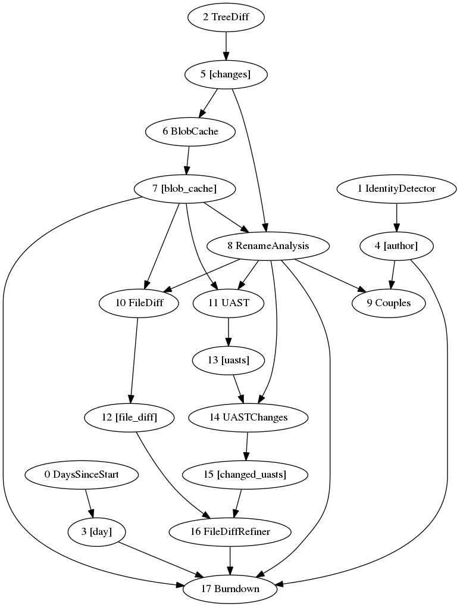
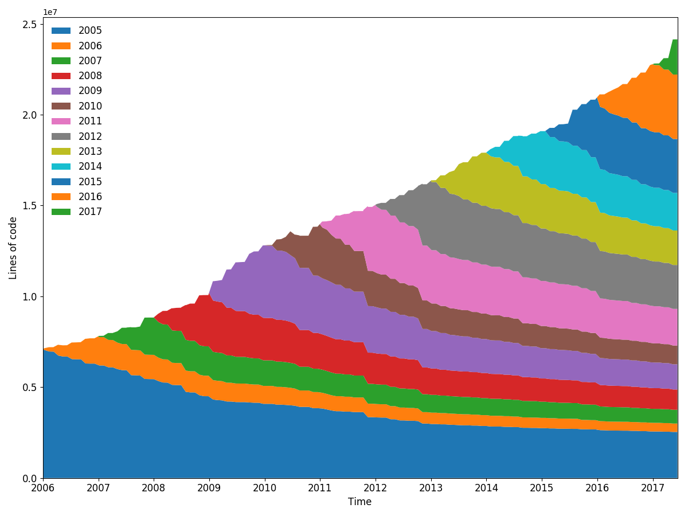
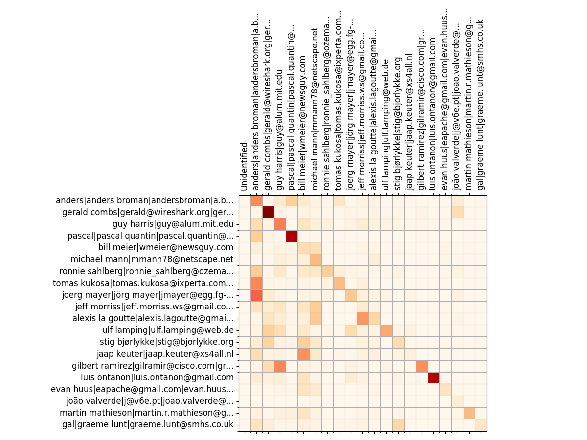
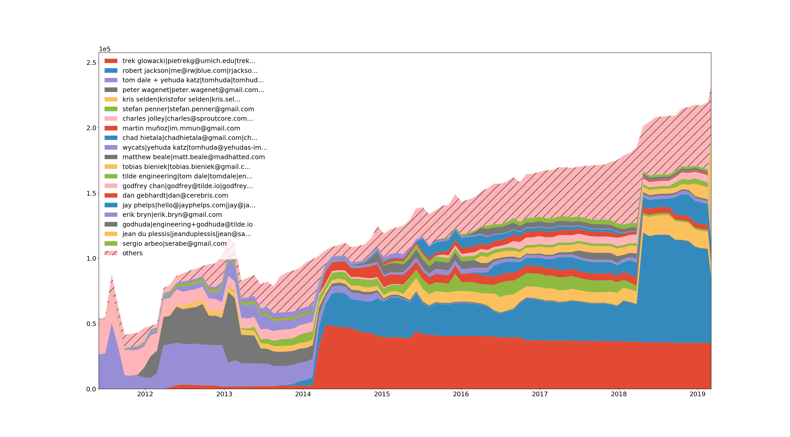
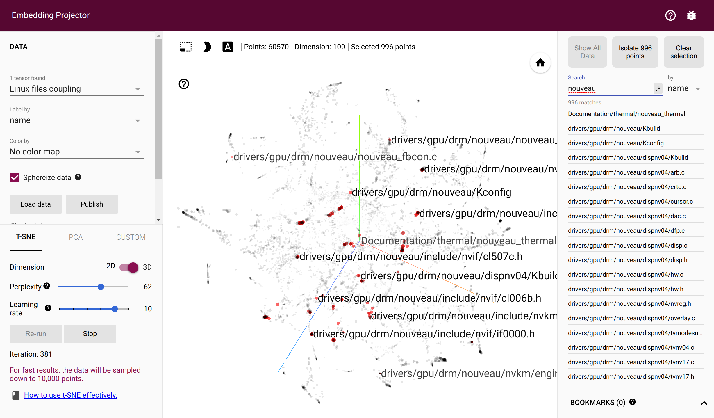
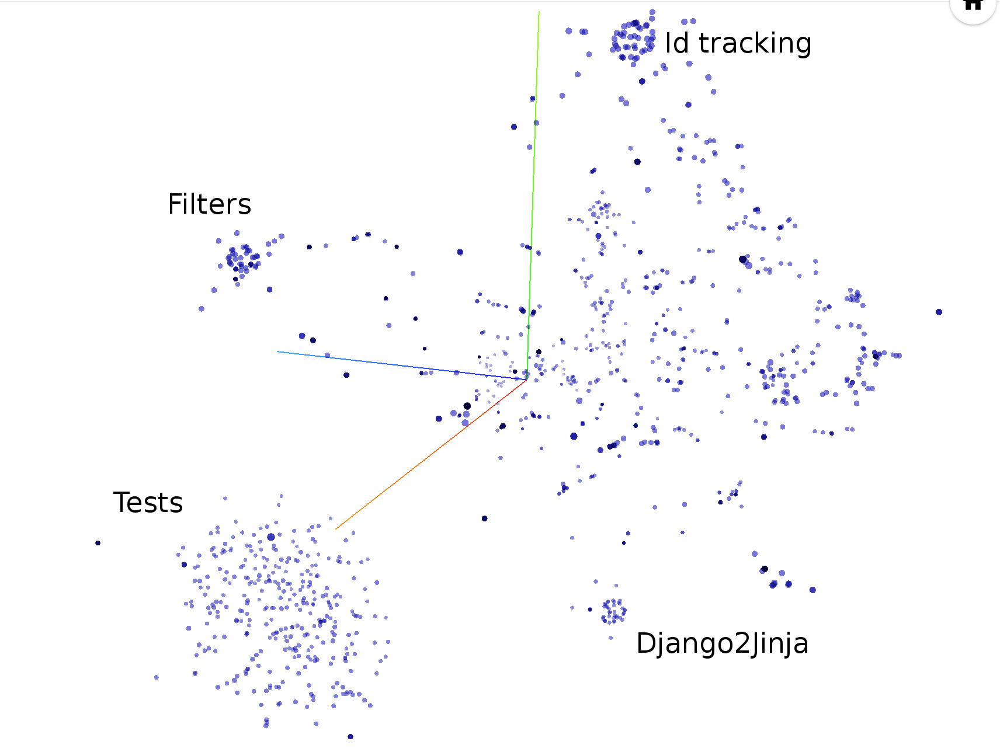
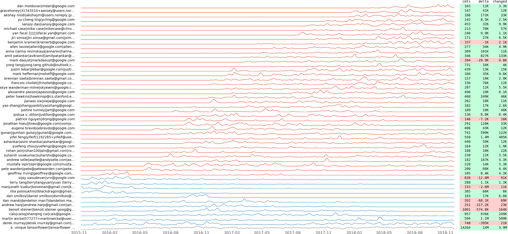
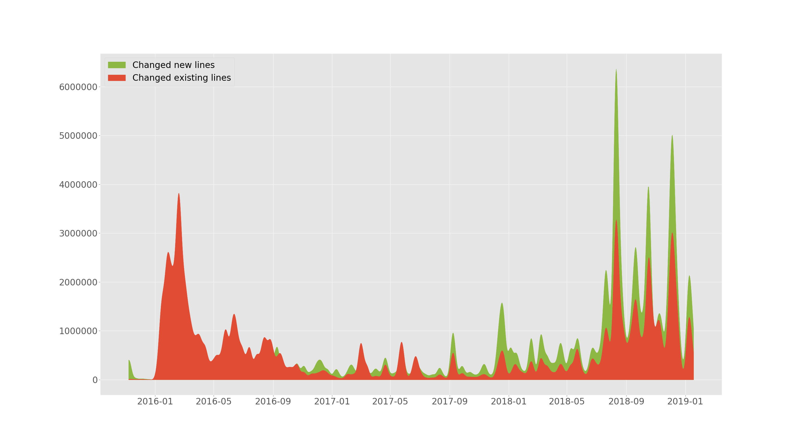
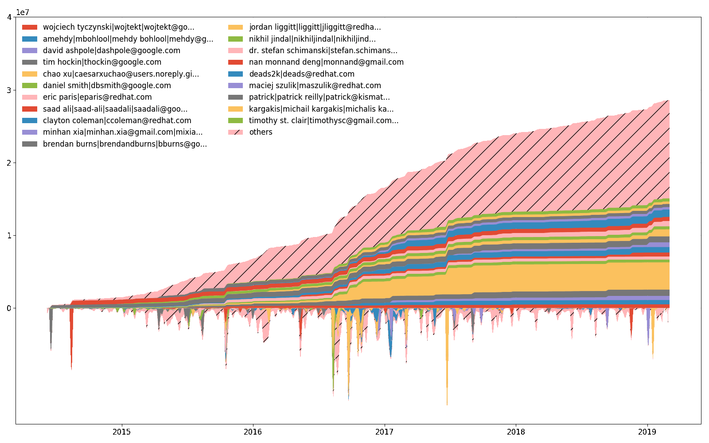
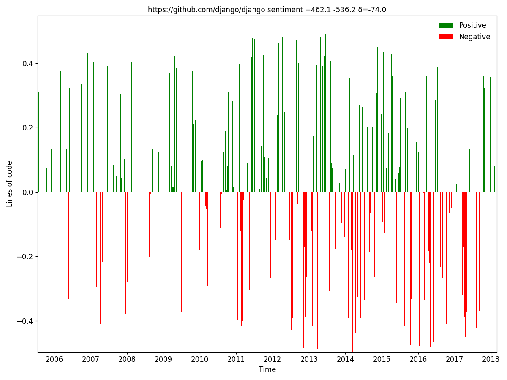

<p align="center">

</p>
<h1 align="center">Hercules</h1>
<p align="center">
      Fast, insightful and highly customizable Git history analysis.<br><br>
      <a href="http://godoc.org/gopkg.in/src-d/hercules.v10"></a>
      <a href="https://travis-ci.com/src-d/hercules"></a>
      <a href="https://ci.appveyor.com/project/vmarkovtsev/hercules"></a>
      <a href="https://pypi.python.org/pypi/labours"></a>
      <a href="https://hub.docker.com/r/srcd/hercules"></a>
      <a href="https://codecov.io/gh/src-d/hercules"></a>
      <a href="https://goreportcard.com/report/github.com/src-d/hercules"></a>
      <a href="https://opensource.org/licenses/Apache-2.0"></a>
</p>
<p align="center">
  <a href="#overview">Overview</a> •
  <a href="#usage">How To Use</a> •
  <a href="#installation">Installation</a> •
  <a href="#contributions">Contributions</a> •
  <a href="#license">License</a>
</p>

--------

## Overview

Hercules is an amazingly fast and highly customizable Git repository analysis engine written in Go. Batteries are included.
Powered by [go-git](https://github.com/src-d/go-git) and [Babelfish](https://doc.bblf.sh).

There are two command-line tools: `hercules` and `labours`. The first is a program
written in Go which takes a Git repository and executes a Directed Acyclic Graph (DAG) of [analysis tasks](doc/PIPELINE_ITEMS.md) over the full commit history.
The second is a Python script which shows some predefined plots over the collected data. These two tools are normally used together through
a pipe. It is possible to write custom analyses using the plugin system. It is also possible
to merge several analysis results together - relevant for organizations. 
The analyzed commit history includes branches, merges, etc.

Hercules has been successfully used for several internal projects at [source{d}](https://sourced.tech).
There are blog posts: [1](https://blog.sourced.tech/post/hercules.v10), [2](https://blog.sourced.tech/post/hercules) and
a [presentation](http://vmarkovtsev.github.io/gowayfest-2018-minsk/). Please [contribute](#contributions)
by testing, fixing bugs, adding [new analyses](https://github.com/src-d/hercules/issues?q=is%3Aissue+is%3Aopen+label%3Anew-analysis), or coding swagger!


<p align="center">The DAG of burndown and couples analyses with UAST diff refining. Generated with <code>hercules --burndown --burndown-people --couples --feature=uast --dry-run --dump-dag doc/dag.dot https://github.com/src-d/hercules</code></p>


<p align="center">torvalds/linux line burndown (granularity 30, sampling 30, resampled by year). Generated with <code>hercules --burndown --first-parent --pb https://github.com/torvalds/linux | labours -f pb -m burndown-project</code> in 1h 40min.</p>

## Installation

Grab `hercules` binary from the [Releases page](https://github.com/src-d/hercules/releases).
`labours` is installable from [PyPi](https://pypi.org/):

```
pip3 install labours
```

[`pip3`](https://pip.pypa.io/en/stable/installing/) is the Python package manager.

Numpy and Scipy can be installed on Windows using http://www.lfd.uci.edu/~gohlke/pythonlibs/

### Build from source
You are going to need Go (>= v1.10), [`protoc`](https://github.com/google/protobuf/releases),
and [`dep`](https://github.com/golang/dep).
```
go get -d gopkg.in/src-d/hercules.v10/cmd/hercules
cd $GOPATH/src/gopkg.in/src-d/hercules.v10
make
pip3 install -e ./python
```

Replace `$GOPATH` with `%GOPATH%` on Windows.

## Contributions

...are welcome! See [CONTRIBUTING](CONTRIBUTING.md) and [code of conduct](CODE_OF_CONDUCT.md).

## License
[Apache 2.0](LICENSE.md)

## Usage

The most useful and reliably up-to-date command line reference:

```
hercules --help
```

Some examples:

```
# Use "memory" go-git backend and display the burndown plot. "memory" is the fastest but the repository's git data must fit into RAM.
hercules --burndown https://github.com/src-d/go-git | labours -m burndown-project --resample month
# Use "file system" go-git backend and print some basic information about the repository.
hercules /path/to/cloned/go-git
# Use "file system" go-git backend, cache the cloned repository to /tmp/repo-cache, use Protocol Buffers and display the burndown plot without resampling.
hercules --burndown --pb https://github.com/git/git /tmp/repo-cache | labours -m burndown-project -f pb --resample raw

# Now something fun
# Get the linear history from git rev-list, reverse it
# Pipe to hercules, produce burndown snapshots for every 30 days grouped by 30 days
# Save the raw data to cache.yaml, so that later is possible to labours -i cache.yaml
# Pipe the raw data to labours, set text font size to 16pt, use Agg matplotlib backend and save the plot to output.png
git rev-list HEAD | tac | hercules --commits - --burndown https://github.com/git/git | tee cache.yaml | labours -m burndown-project --font-size 16 --backend Agg --output git.png
```

`labours -i /path/to/yaml` allows to read the output from `hercules` which was saved on disk.

#### Caching

It is possible to store the cloned repository on disk. The subsequent analysis can run on the
corresponding directory instead of cloning from scratch:

```
# First time - cache
hercules https://github.com/git/git /tmp/repo-cache

# Second time - use the cache
hercules --some-analysis /tmp/repo-cache
```

#### Docker image

```
docker run --rm srcd/hercules hercules --burndown --pb https://github.com/git/git | docker run --rm -i -v $(pwd):/io srcd/hercules labours -f pb -m burndown-project -o /io/git_git.png
```

### Built-in analyses

#### Project burndown

```
hercules --burndown
labours -m burndown-project
```

Line burndown statistics for the whole repository.
Exactly the same what [git-of-theseus](https://github.com/erikbern/git-of-theseus)
does but much faster. Blaming is performed efficiently and incrementally using a custom RB tree tracking
algorithm, and only the last modification date is recorded while running the analysis.

All burndown analyses depend on the values of *granularity* and *sampling*.
Granularity is the number of days each band in the stack consists of. Sampling
is the frequency with which the burnout state is snapshotted. The smaller the
value, the more smooth is the plot but the more work is done.

There is an option to resample the bands inside `labours`, so that you can
define a very precise distribution and visualize it different ways. Besides,
resampling aligns the bands across periodic boundaries, e.g. months or years.
Unresampled bands are apparently not aligned and start from the project's birth date.

#### Files

```
hercules --burndown --burndown-files
labours -m burndown-file
```

Burndown statistics for every file in the repository which is alive in the latest revision.

Note: it will generate separate graph for every file. You might don't want to run it on repository with many files.

#### People

```
hercules --burndown --burndown-people [--people-dict=/path/to/identities]
labours -m burndown-person
```

Burndown statistics for the repository's contributors. If `--people-dict` is not specified, the identities are
discovered by the following algorithm:

0. We start from the root commit towards the HEAD. Emails and names are converted to lower case.
1. If we process an unknown email and name, record them as a new developer.
2. If we process a known email but unknown name, match to the developer with the matching email,
and add the unknown name to the list of that developer's names.
3. If we process an unknown email but known name, match to the developer with the matching name,
and add the unknown email to the list of that developer's emails.

If `--people-dict` is specified, it should point to a text file with the custom identities. The
format is: every line is a single developer, it contains all the matching emails and names separated
by `|`. The case is ignored.

#### Churn matrix


<p align="center">Wireshark top 20 devs - churn matrix</p>

```
hercules --burndown --burndown-people [--people-dict=/path/to/identities]
labours -m churn-matrix
```

Beside the burndown information, `--burndown-people` collects the added and deleted line statistics per
developer. Thus it can be visualized how many lines written by developer A are removed by developer B.
This indicates collaboration between people and defines expertise teams.

The format is the matrix with N rows and (N+2) columns, where N is the number of developers.

1. First column is the number of lines the developer wrote.
2. Second column is how many lines were written by the developer and deleted by unidentified developers
(if `--people-dict` is not specified, it is always 0).
3. The rest of the columns show how many lines were written by the developer and deleted by identified
developers.

The sequence of developers is stored in `people_sequence` YAML node.

#### Code ownership


<p align="center">Ember.js top 20 devs - code ownership</p>

```
hercules --burndown --burndown-people [--people-dict=/path/to/identities]
labours -m ownership
```

`--burndown-people` also allows to draw the code share through time stacked area plot. That is,
how many lines are alive at the sampled moments in time for each identified developer.

#### Couples


<p align="center">torvalds/linux files' coupling in Tensorflow Projector</p>

```
hercules --couples [--people-dict=/path/to/identities]
labours -m couples -o <name> [--couples-tmp-dir=/tmp]
```

**Important**: it requires Tensorflow to be installed, please follow [official instructions](https://www.tensorflow.org/install/).

The files are coupled if they are changed in the same commit. The developers are coupled if they
change the same file. `hercules` records the number of couples throughout the whole commit history
and outputs the two corresponding co-occurrence matrices. `labours` then trains
[Swivel embeddings](https://github.com/src-d/tensorflow-swivel) - dense vectors which reflect the
co-occurrence probability through the Euclidean distance. The training requires a working
[Tensorflow](http://tensorflow.org) installation. The intermediate files are stored in the
system temporary directory or `--couples-tmp-dir` if it is specified. The trained embeddings are
written to the current working directory with the name depending on `-o`. The output format is TSV
and matches [Tensorflow Projector](http://projector.tensorflow.org/) so that the files and people
can be visualized with t-SNE implemented in TF Projector.

#### Structural hotness

```
      46  jinja2/compiler.py:visit_Template [FunctionDef]
      42  jinja2/compiler.py:visit_For [FunctionDef]
      34  jinja2/compiler.py:visit_Output [FunctionDef]
      29  jinja2/environment.py:compile [FunctionDef]
      27  jinja2/compiler.py:visit_Include [FunctionDef]
      22  jinja2/compiler.py:visit_Macro [FunctionDef]
      22  jinja2/compiler.py:visit_FromImport [FunctionDef]
      21  jinja2/compiler.py:visit_Filter [FunctionDef]
      21  jinja2/runtime.py:__call__ [FunctionDef]
      20  jinja2/compiler.py:visit_Block [FunctionDef]
```

Thanks to Babelfish, hercules is able to measure how many times each structural unit has been modified.
By default, it looks at functions; refer to [Semantic UAST XPath](https://docs.sourced.tech/babelfish/using-babelfish/uast-querying)
manual to switch to something else.

```
hercules --shotness [--shotness-xpath-*]
labours -m shotness
```

Couples analysis automatically loads "shotness" data if available.


<p align="center"><code>hercules --shotness --pb https://github.com/pallets/jinja | labours -m couples -f pb</code></p>

#### Aligned commit series


<p align="center">tensorflow/tensorflow aligned commit series of top 50 developers by commit number.</p>

```
hercules --devs [--people-dict=/path/to/identities]
labours -m devs -o <name>
```

We record how many commits made, as well as lines added, removed and changed per day for each developer.
We plot the resulting commit time series using a few tricks to show the temporal grouping. In other words,
two adjacent commit series should look similar after normalization.

1. We compute the distance matrix of the commit series. Our distance metric is
[Dynamic Time Warping](https://en.wikipedia.org/wiki/Dynamic_time_warping).
We use [FastDTW](https://cs.fit.edu/~pkc/papers/tdm04.pdf) algorithm which has linear complexity
proportional to the length of time series. Thus the overall complexity of computing the matrix is quadratic.
2. We compile the linear list of commit series with
[Seriation](http://nicolas.kruchten.com/content/2018/02/seriation/) technique.
Particularly, we solve the [Travelling Salesman Problem](https://en.wikipedia.org/wiki/Travelling_salesman_problem) which is NP-complete.
However, given the typical number of developers which is less than 1,000, there is a good chance that
the solution does not take much time. We use [Google or-tools](https://developers.google.com/optimization/routing/tsp) solver.
3. We find 1-dimensional clusters in the resulting path with [HDBSCAN](https://hdbscan.readthedocs.io/en/latest/how_hdbscan_works.html)
algorithm and assign colors accordingly.
4. Time series are smoothed by convolving with the [Slepian window](https://en.wikipedia.org/wiki/Window_function#DPSS_or_Slepian_window).

This plot allows to discover how the development team evolved through time. It also shows "commit flashmobs"
such as [Hacktoberfest](https://hacktoberfest.digitalocean.com/). For example, here are the revealed
insights from the `tensorflow/tensorflow` plot above:

1. "Tensorflow Gardener" is classified as the only outlier.
2. The "blue" group of developers covers the global maintainers and a few people who left (at the top).
3. The "red" group shows how core developers join the project or become less active.

#### Added vs changed lines through time


<p align="center">tensorflow/tensorflow added and changed lines through time.</p>

```
hercules --devs [--people-dict=/path/to/identities]
labours -m old-vs-new -o <name>
```

`--devs` from the previous section allows to plot how many lines were added and how many existing changed
(deleted or replaced) through time. This plot is smoothed.

#### Efforts through time


<p align="center">kubernetes/kubernetes efforts through time.</p>

```
hercules --devs [--people-dict=/path/to/identities]
labours -m devs-efforts -o <name>
```

Besides, `--devs` allows to plot how many lines have been changed (added or removed) by each developer.
The upper part of the plot is an accumulated (integrated) lower part. It is impossible to have the same scale
for both parts, so the lower values are scaled, and hence there are no lower Y axis ticks.
There is a difference between the efforts plot and the ownership plot, although changing lines correlate
with owning lines.

#### Sentiment (positive and negative comments)


<p align="center">It can be clearly seen that Django comments were positive/optimistic in the beginning, but later became negative/pessimistic.<br><code>hercules --sentiment --pb https://github.com/django/django | labours -m sentiment -f pb</code></p>

We extract new and changed comments from source code on every commit, apply [BiDiSentiment](https://github.com/vmarkovtsev/bidisentiment)
general purpose sentiment recurrent neural network and plot the results. Requires
[libtensorflow](https://www.tensorflow.org/install/install_go).
E.g. [`sadly, we need to hide the rect from the documentation finder for now`](https://github.com/pygame/pygame/commit/b6091d38c8a5639d311858660b38841d96598509#diff-eae59f175858fcef57cb17e733981c73R27) is negative and
[`Theano has a built-in optimization for logsumexp (...) so we can just write the expression directly`](https://github.com/keras-team/keras/commit/7d52af64c03e71bcd23112a7086dc8aab1b37ed2#diff-ff634bb5c5441d7052449f20018872b8R549)
is positive. Don't expect too much though - as was written, the sentiment model is
general purpose and the code comments have different nature, so there is no magic (for now).

Hercules must be built with "tensorflow" tag - it is not by default:

```
make TAGS=tensorflow
```

Such a build requires [`libtensorflow`](https://www.tensorflow.org/install/install_go).

#### Everything in a single pass

```
hercules --burndown --burndown-files --burndown-people --couples --shotness --devs [--people-dict=/path/to/identities]
labours -m all
```

### Plugins

Hercules has a plugin system and allows to run custom analyses. See [PLUGINS.md](PLUGINS.md).

### Merging

`hercules combine` is the command which joins several analysis results in Protocol Buffers format together.

```
hercules --burndown --pb https://github.com/src-d/go-git > go-git.pb
hercules --burndown --pb https://github.com/src-d/hercules > hercules.pb
hercules combine go-git.pb hercules.pb | labours -f pb -m burndown-project --resample M
```

### Bad unicode errors

YAML does not support the whole range of Unicode characters and the parser on `labours` side
may raise exceptions. Filter the output from `hercules` through `fix_yaml_unicode.py` to discard
such offending characters.

```
hercules --burndown --burndown-people https://github.com/... | python3 fix_yaml_unicode.py | labours -m people
```

### Plotting

These options affects all plots:

```
labours [--style=white|black] [--backend=] [--size=Y,X]
```

`--style` sets the general style of the plot (see `labours --help`).
`--background` changes the plot background to be either white or black.
`--backend` chooses the Matplotlib backend.
`--size` sets the size of the figure in inches. The default is `12,9`.

(required in macOS) you can pin the default Matplotlib backend with

```
echo "backend: TkAgg" > ~/.matplotlib/matplotlibrc
```

These options are effective in burndown charts only:

```
labours [--text-size] [--relative]
```

`--text-size` changes the font size, `--relative` activate the stretched burndown layout.

### Custom plotting backend

It is possible to output all the information needed to draw the plots in JSON format.
Simply append `.json` to the output (`-o`) and you are done. The data format is not fully
specified and depends on the Python code which generates it. Each JSON file should
contain `"type"` which reflects the plot kind.

### Caveats

1. Processing all the commits may fail in some rare cases. If you get an error similar to https://github.com/src-d/hercules/issues/106
please report there and specify `--first-parent` as a workaround.
1. Burndown collection may fail with an Out-Of-Memory error. See the next session for the workarounds.
1. Parsing YAML in Python is slow when the number of internal objects is big. `hercules`' output
for the Linux kernel in "couples" mode is 1.5 GB and takes more than an hour / 180GB RAM to be
parsed. However, most of the repositories are parsed within a minute. Try using Protocol Buffers
instead (`hercules --pb` and `labours -f pb`).
1. To speed up yaml parsing
   ```
   # Debian, Ubuntu
   apt install libyaml-dev
   # macOS
   brew install yaml-cpp libyaml

   # you might need to re-install pyyaml for changes to make effect
   pip uninstall pyyaml
   pip --no-cache-dir install pyyaml
   ```

### Burndown Out-Of-Memory

If the analyzed repository is big and extensively uses branching, the burndown stats collection may
fail with an OOM. You should try the following:

1. Read the repo from disk instead of cloning into memory.
2. Use `--skip-blacklist` to avoid analyzing the unwanted files. It is also possible to constrain the `--language`.
3. Use the [hibernation](doc/HIBERNATION.md) feature: `--hibernation-distance 10 --burndown-hibernation-threshold=1000`. Play with those two numbers to start hibernating right before the OOM.
4. Hibernate on disk: `--burndown-hibernation-disk --burndown-hibernation-dir /path`.
5. `--first-parent`, you win.
