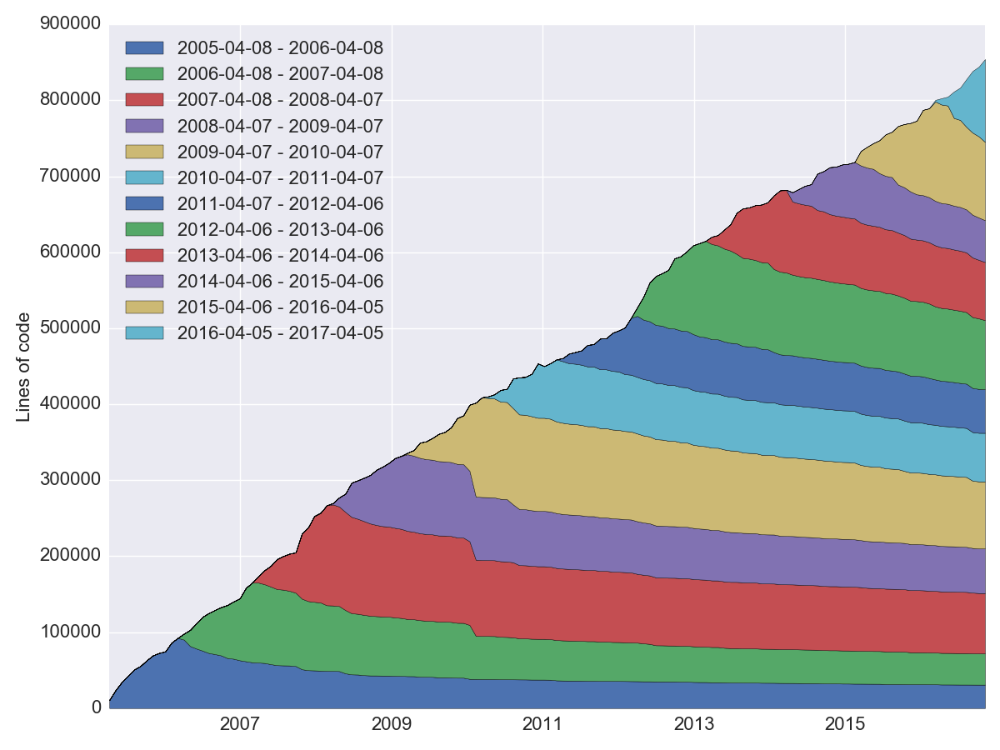

[](https://travis-ci.org/src-d/hercules)

Hercules
--------

This tool calculates the lines burnout stats in a Git repository.
Exactly the same what [git-of-theseus](https://github.com/erikbern/git-of-theseus)
does actually, but using [go-git](https://github.com/src-d/go-git).
Why? [source{d}](http://sourced.tech) builds it's own data pipeline to
process every git repository in the world and the calculation of the
annual burnout ratio will be embedded into it. This project is the
open source implementation of the specific `git blame` flavour on top
of go-git. It is done incrementally using the custom RB tree tracking
algorithm, only the last modification date is recorded.

There are two tools: `hercules` and `labours.py`. The first is the program
written in Go which collects the burnout stats from a Git repository.
The second is the Python script which draws the stack area plot. They
are normally used together through a pipe. `hercules` prints
text results. The first line is three numbers: UNIX timestamp which
corresponds to the time the repository was created, *granularity* and *sampling*.
Granularity is the number of days each band in the stack consists of. For example,
to get the annual burnout plot, set granularity to 365. Sampling is the
frequency with which the burnout is snapshotted. The smaller the value,
the more smooth is the plot but the more work is done.


<p align="center">git/git burndown (granularity 365, sampling 30, no resampling)</p>

### Installation
You are going to need Go and Python 2 or 3.
```
go get gopkg.in/src-d/hercules.v1/cmd/hercules
pip install pandas seaborn
wget https://github.com/src-d/hercules/raw/master/labours.py
```

### Usage
```
# Use "memory" go-git backend and display the plot. This is the fastest but the repository data must fit into RAM.
hercules https://github.com/src-d/go-git | python3 labours.py --resample month
# Use "file system" go-git backend and print the raw data.
hercules /path/to/cloned/go-git
# Use "file system" go-git backend, cache the cloned repository to /tmp/repo-cache and display the plot.
hercules https://github.com/git/git /tmp/repo-cache | python3 labours.py --resample month

# Now something fun
# Get the linear history from git rev-list, reverse it
# Pipe to hercules, produce the snapshots for every 30 days grouped by 30 days
# Save the raw data to cache.txt, so that later simply cat cache.txt | python3 labours.py
# Pipe the raw data to labours.py, set text font size to 16pt, use Agg matplotlib backend and save the plot to output.png
git rev-list HEAD | tac | hercules -commits - https://github.com/git/git | tee cache.txt | python3 labours.py --font-size 16 --backend Agg --output git.png
```

### Caveats

1. Currently, go-git's "file system" backend does not cache anything in memory.
Every object retrieval operation decompresses the packfiles, parses them, etc.
Effectively, the performance **slowdown** is **10x**. This will be fixed
in the future.

### License
MIT.
