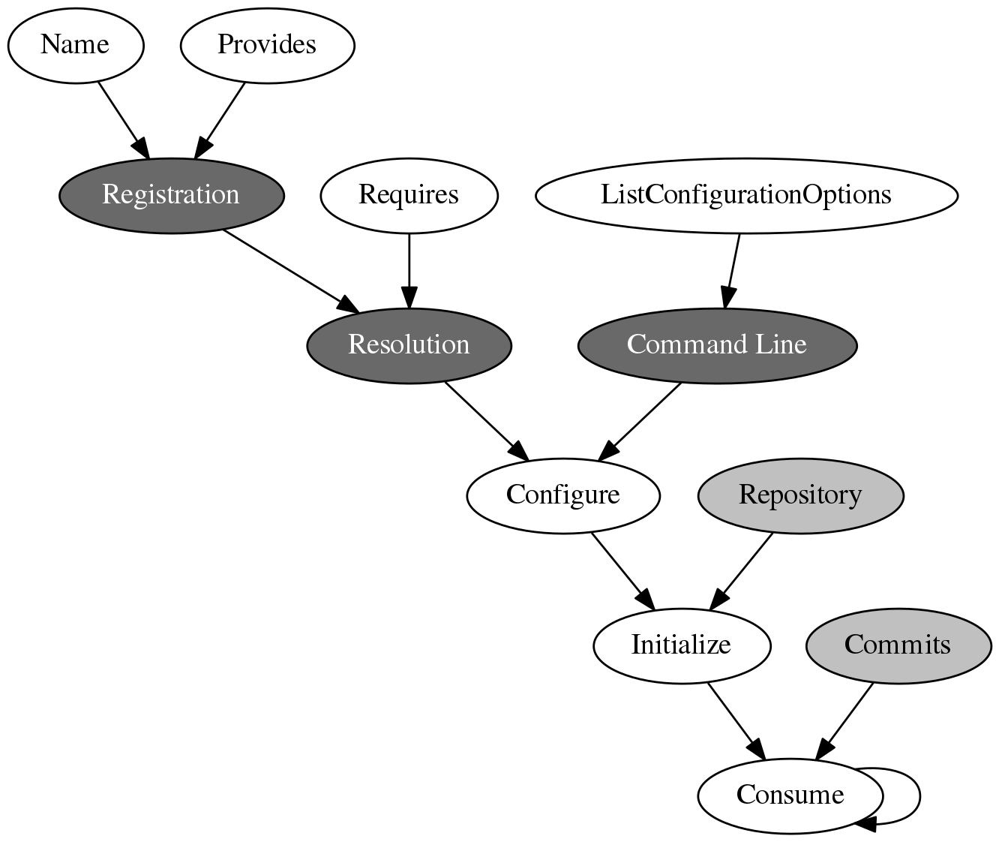
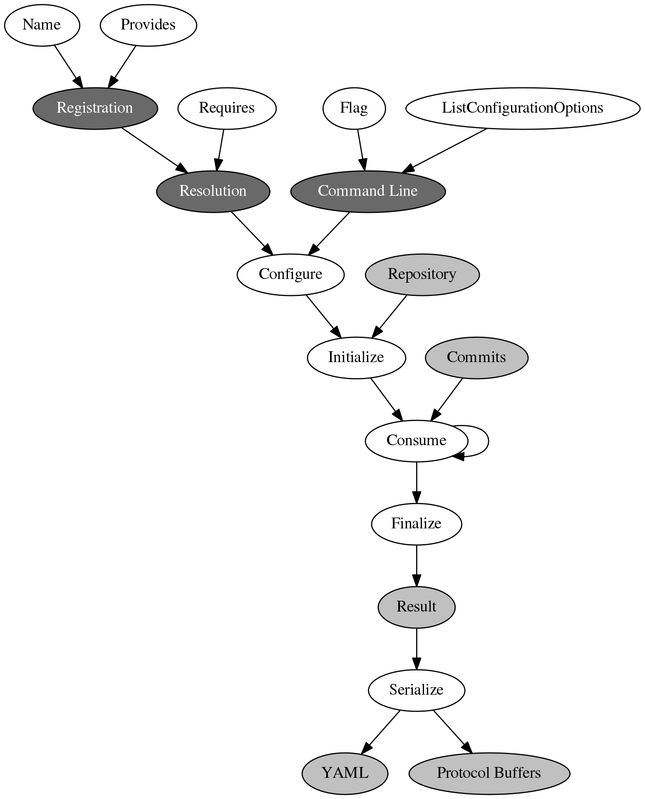
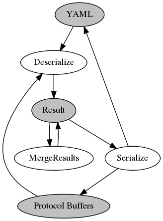
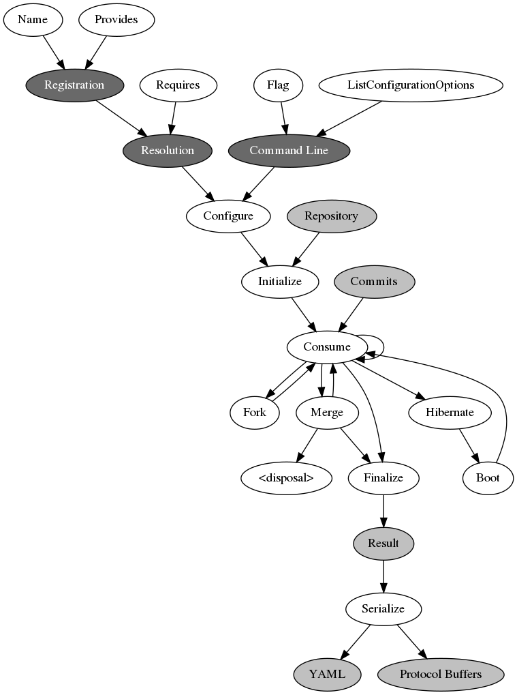

Pipeline items
==============

### PipelineItem lifecycle

```go
// PipelineItem is the interface for all the units in the Git commits analysis pipeline.
type PipelineItem interface {
	// Name returns the name of the analysis.
	Name() string
	// Provides returns the list of keys of reusable calculated entities.
	// Other items may depend on them.
	Provides() []string
	// Requires returns the list of keys of needed entities which must be supplied in Consume().
	Requires() []string
	// ListConfigurationOptions returns the list of available options which can be consumed by Configure().
	ListConfigurationOptions() []ConfigurationOption
	// Configure performs the initial setup of the object by applying parameters from facts.
	// It allows to create PipelineItems in a universal way.
	Configure(facts map[string]interface{})
	// Initialize prepares and resets the item. Consume() requires Initialize()
	// to be called at least once beforehand.
	Initialize(*git.Repository)
	// Consume processes the next commit.
	// deps contains the required entities which match Depends(). Besides, it always includes
	// "commit" and "index".
	// Returns the calculated entities which match Provides().
	Consume(deps map[string]interface{}) (map[string]interface{}, error)
	// Fork clones the item the requested number of times. The data links between the clones
	// are up to the implementation. Needed to handle Git branches. See also Merge().
	// Returns a slice with `n` fresh clones. In other words, it does not include the original item.
	Fork(n int) []PipelineItem
	// Merge combines several branches together. Each is supposed to have been created with Fork().
	// The result is stored in the called item, thus this function returns nothing.
	// Merge() must update all the branches, not only self. When several branches merge, some of
	// them may continue to live, hence this requirement.
	Merge(branches []PipelineItem)
}
```



### LeafPipelineItem lifecycle

```go
// LeafPipelineItem corresponds to the top level pipeline items which produce the end results.
type LeafPipelineItem interface {
	PipelineItem
	// Flag returns the cmdline name of the item.
	Flag() string
	// Finalize returns the result of the analysis.
	Finalize() interface{}
	// Serialize encodes the object returned by Finalize() to Text or Protocol Buffers.
	Serialize(result interface{}, binary bool, writer io.Writer) error
}
```



### MergeablePipelineItem ability (optional for LeafPipelineItem-s)

```go
// ResultMergeablePipelineItem specifies the methods to combine several analysis results together.
type ResultMergeablePipelineItem interface {
	LeafPipelineItem
	// Deserialize loads the result from Protocol Buffers blob.
	Deserialize(pbmessage []byte) (interface{}, error)
	// MergeResults joins two results together. Common-s are specified as the global state.
	MergeResults(r1, r2 interface{}, c1, c2 *CommonAnalysisResult) interface{}
}
```



### HibernateablePipelineItem (optional)

See [what is hibernation](HIBERNATION.md).

```go
// HibernateablePipelineItem is the interface to allow pipeline items to be frozen (compacted, unloaded)
// while they are not needed in the hosting branch.
type HibernateablePipelineItem interface {
	PipelineItem
	// Hibernate signals that the item is temporarily not needed and it's memory can be optimized.
	Hibernate() error
	// Boot signals that the item is needed again and must be de-hibernate-d.
	Boot() error
}
```


